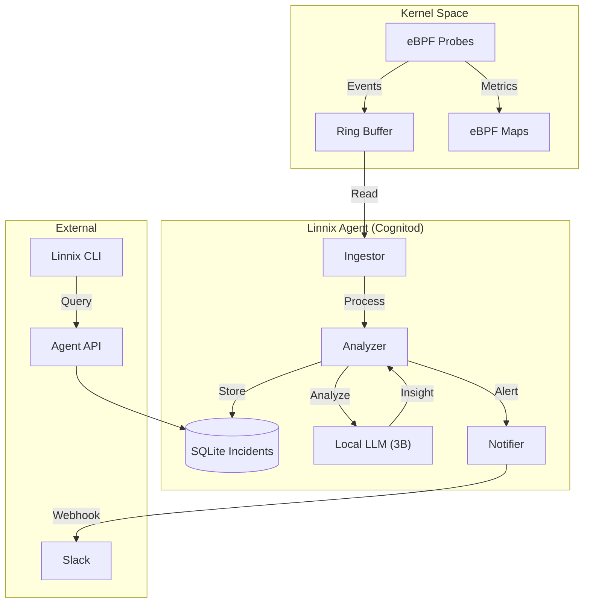

# Linnix System Architecture

This document provides a high-level overview of the Linnix architecture for security and operational reviews.

## High-Level Diagram

## Components

### 1. eBPF Probes (Kernel Space)
*   **Role**: Safely collect system metrics (CPU, Memory, I/O) and process lifecycle events (exec, exit, OOM).
*   **Security**: Read-only by default. Enforcement (kill) is only triggered if explicitly enabled and safety thresholds are met.
*   **Overhead**: Extremely low (<1% CPU).

### 2. Cognitod (User Space Daemon)
*   **Role**: The brain of the agent. Consumes events from the ring buffer, maintains state, and decides when to trigger a circuit breaker.
*   **Local LLM**: An embedded, lightweight language model (distilled 3B parameter) runs locally to analyze incident context. No data leaves your server for analysis.

### 3. SQLite Store
*   **Role**: Persists incident history, audit logs, and AI insights.
*   **Location**: `/var/lib/linnix/data.db` (configurable).

### 4. Linnix CLI
*   **Role**: Operator tool for querying status (`doctor`), viewing history (`blame`), and managing configuration.

## Security Model
*   **Root Access**: Required for loading eBPF programs.
*   **Network**: Only requires outbound HTTPS for Slack alerts. No inbound ports need to be exposed to the internet.
*   **Data Privacy**: All telemetry and AI analysis happen locally. No raw data is sent to Linnix servers.
